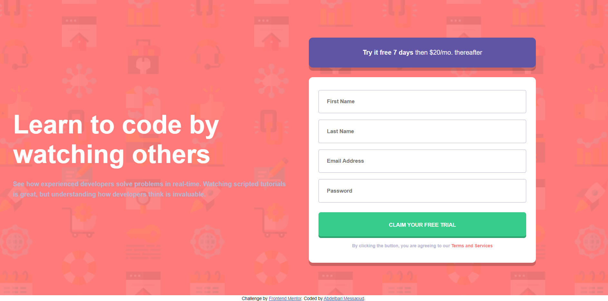
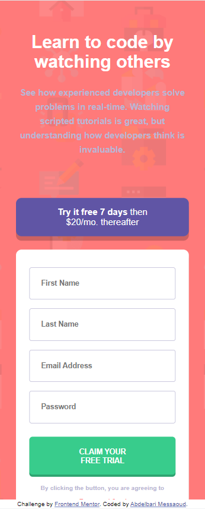

# Frontend Mentor - Intro component with sign up form

this is a solution to the sign up form mockup [challenge](https://www.frontendmentor.io/challenges/intro-component-with-signup-form-5cf91bd49edda32581d28fd1)

## Table of contents

- [Overview](#overview)
  - [The challenge](#the-challenge)
  - [Screenshot](#screenshot)
- [My process](#my-process)
  - [Built with](#built-with)
  - [What I learned](#what-i-learned)
  - [Continued development](#continued-development)
- [Author](#author)

# overview

## The challenge

Your challenge is to build out this introductory component and get it looking as close to the design as possible.

You can use any tools you like to help you complete the challenge. So if you've got something you'd like to practice, feel free to give it a go.

Your users should be able to:

- View the optimal layout for the site depending on their device's screen size
- See hover states for all interactive elements on the page
- Receive an error message when the `form` is submitted if:
  - Any `input` field is empty. The message for this error should say _"[Field Name] cannot be empty"_
  - The email address is not formatted correctly (i.e. a correct email address should have this structure: `name@host.tld`). The message for this error should say _"Looks like this is not an email"_

## screenshot:

### desktop:

### mobile:

# my process

## built with:

- Semantic HTML5 markup
- CSS custom properties
- Flexbox
- JavaScript
- BEM norms

## What I learned

always begin with the mobile view first then work up to more complex UI like the desktop and tablet because it is more complex and you spend less time overriding stuff you already made.

## Continued development

- working with JS objects is more tricky than I thought and I need to use it more often to get the hang of it, regex is useful but tricky aswell.

## Author

- Frontend Mentor - [@barimess](https://www.frontendmentor.io/profile/barimess
- Twitter - [@barimess1](https://www.twitter.com/barimess1)
